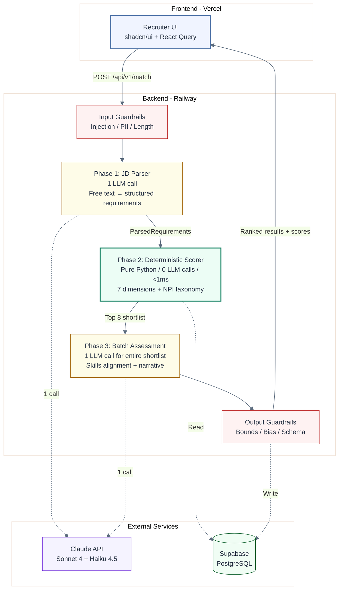
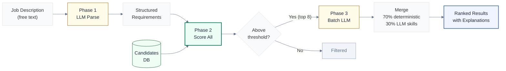

# Physician Candidate Matcher

AI-powered physician-job matching that uses LLM intelligence where it matters and deterministic scoring where it doesn't. Two API calls to Claude, regardless of candidate pool size.

**[Try the Live App](https://frontend-phi-ruby-58.vercel.app/match)** | **[API Docs](https://physician-matcher-api-production.up.railway.app/docs)** | **[Testing Guide](docs/TESTING-GUIDE.md)**

## The Problem

Healthcare recruiters manually match physicians to job openings. The current process: read a job description, flip through candidate profiles, make gut calls on fit. At scale, this is slow, inconsistent, and expensive.

Existing AI solutions fall into two traps:

1. **Call an LLM for every field** - accurate but expensive. 30 candidates x 6 dimensions = 180 API calls per match. Cost scales linearly with pool size.
2. **Keyword matching** - cheap but inaccurate. "Interventional Cardiology" and "Cardiac Catheterization" are treated as unrelated strings.

Neither approach works for a recruiting firm processing thousands of placements per year.

## The Solution

A two-phase architecture that uses LLM intelligence only where it adds value.

**Phase 1: Parse JD into structured requirements (1 LLM call).** Free-text job descriptions contain implicit requirements that keyword matching misses. The LLM extracts specialty, adjacent specialties, required licenses, skills, experience ranges, and dealbreakers into a typed `ParsedRequirements` dataclass.

**Phase 2: Score all candidates deterministically (0 LLM calls, <1ms).** Six scoring dimensions run as pure Python functions against structured candidate data. No hallucination risk. No cost. Predictable, testable, fast. Candidates below 0.25 composite score are filtered out.

**Phase 3: Batch-assess the shortlist (1 LLM call).** The top 8 candidates from Phase 2 are sent to Claude in a single batch prompt for clinical skills assessment and recruiter-ready narratives. One call covers all shortlisted candidates.

**Result: 2 LLM calls total, regardless of candidate pool size.**

## Architecture

### System Overview



> Green = no LLM cost. Yellow = LLM call. Red = guardrails. Phase 2 handles 7 dimensions in pure Python for $0.00.

### Matching Pipeline



## Key Design Decisions

| Decision | Alternative | Why This |
|----------|-------------|----------|
| Direct Anthropic SDK | LangChain / LlamaIndex | One dependency, full control over retries and cost tracking. No abstraction layer to debug through. LangChain adds ~15 transitive dependencies for a two-prompt application. |
| Deterministic scoring first | LLM for everything | Zero cost, zero hallucination, <1ms per candidate. LLM calls scale with candidate count otherwise. At 30 candidates, that is 30x the cost for marginal accuracy gain on structured fields. |
| Supabase (Postgres) | SQLite / DynamoDB | Real Postgres with RLS, views, array types, JSONB, and CHECK constraints. Free tier supports development. PostgREST API avoids ORM overhead. |
| Next.js 16 + shadcn/ui | Streamlit / Gradio | Production frontend, not a prototype. Server components, type safety, accessible UI primitives. Recruiter-facing tool needs to look like a product. |
| No RAG / no embeddings | pgvector + semantic search | Candidate data is structured (specialty, licenses, years). Embeddings add complexity without value when you can do exact matching on discrete fields. RAG becomes relevant at 100K+ candidates with unstructured notes. |
| Batch LLM assessment | Per-candidate LLM calls | One prompt with 8 candidates costs the same as one prompt with 1 candidate (input token difference is minimal). 8x fewer API calls, 8x less latency overhead. |

## Cost Analysis

| Approach | LLM Calls | Cost per Match | Latency |
|----------|-----------|----------------|---------|
| V1: Per-candidate LLM | 30 (1 per candidate) | ~$0.27 | ~70s |
| V2: Two-phase (this project) | 2 (fixed) | ~$0.003 | ~5s |

**90% cost reduction. 14x faster.** Cost is fixed regardless of candidate pool size.

Breakdown per match request:
- Phase 1 (JD parse): ~600 input tokens, ~400 output tokens = ~$0.005 (Sonnet, accuracy matters here)
- Phase 2 (deterministic): 0 tokens = $0.00
- Phase 3 (batch assess): ~1500 input tokens, ~800 output tokens = ~$0.003 (Haiku, speed matters here)

## Production Features

- **Input guardrails** - Prompt injection detection (8 patterns), PII redaction (SSN, phone, passport), input length caps, PostgREST query parameter sanitization
- **Output guardrails** - Score bounds clamping (0-100), schema validation on LLM responses, unknown candidate ID rejection, missing assessment detection
- **Bias prevention** - Candidate name, age, gender, and demographics excluded from LLM scoring payload. Scoring bias detection flags suspiciously uniform or extreme score distributions.
- **Cost guardrails** - Per-request cost cap ($0.50), daily cost cap ($25.00), pre-flight cost estimation before LLM calls
- **Observability** - Per-phase tracing with `RequestTrace` and `PhaseMetrics` dataclasses. Every LLM call logged with input/output tokens, cost, latency, and success/failure. High-latency (>30s) and high-cost (>$0.10) alerts.
- **Eval framework** - 5 golden test cases covering specialty mismatch, credential gaps, location misses, and experience shortfalls. Zero LLM calls, runs in <10ms. Feedback loop analysis for production quality drift detection.
- **Deep health checks** - Connectivity tests for Supabase and Claude API with latency measurements. Separate from load balancer health endpoint.
- **Error handling** - Custom exception hierarchy (`MatchingError`, `ClaudeAPIError`, `ValidationError`, `RateLimitError`) mapped to HTTP status codes. Exponential backoff retry on transient Claude API errors (429, 5xx).

## Quick Start

### Prerequisites

- Python 3.11+
- Node.js 20+
- Supabase account (free tier works)
- Anthropic API key

### Setup

```bash
git clone https://github.com/jothiswaran-arumugam/physician-candidate-matcher
cd physician-candidate-matcher
cp .env.example .env
# Add your ANTHROPIC_API_KEY, SUPABASE_URL, and SUPABASE_KEY to .env
```

### Database

Run `docs/schema.sql` in the Supabase SQL Editor, then seed:

```bash
cd backend
python -m venv venv && source venv/bin/activate
pip install -r requirements.txt
python scripts/seed_candidates.py
```

Seeds 30 physicians across 15 specialties with realistic credentials.

### Development

```bash
# Terminal 1: Backend
make dev-backend    # http://localhost:8000 (API docs at /docs)

# Terminal 2: Frontend
make dev-frontend   # http://localhost:3000
```

## API Endpoints

| Endpoint | Method | Rate Limit | Description |
|----------|--------|------------|-------------|
| `/api/v1/match` | POST | 20/min | Match candidates against a job description. Returns ranked candidates with scores, summaries, strengths, and gaps. |
| `/api/v1/batch` | POST | 5/min | Batch match up to 5 job descriptions. Returns per-job status with result or error. |
| `/api/v1/feedback` | POST | - | Submit recruiter feedback (good_match, bad_match, hired, interviewed) on a candidate match. |
| `/api/v1/feedback/{match_id}` | GET | - | Get all feedback entries for a specific match. |
| `/api/v1/analytics` | GET | - | Aggregate usage stats: total matches, LLM costs, average latency, feedback breakdown. |
| `/api/v1/analytics/costs` | GET | - | Daily cost aggregation for budget monitoring. Accepts `days` query parameter (1-365). |
| `/api/v1/eval/golden-set` | GET | - | Run 5 golden test cases against the deterministic scorer. Zero LLM calls. |
| `/api/v1/health` | GET | - | Lightweight health check for load balancers. No downstream calls. |
| `/api/v1/health/deep` | GET | - | Deep health check testing Supabase and Claude API connectivity with latency. |

## Tech Stack

| Layer | Technology | Purpose |
|-------|-----------|---------|
| Frontend | Next.js 16, React 19, shadcn/ui, Tailwind CSS 4 | Recruiter-facing UI with candidate cards, score breakdowns, feedback buttons |
| State | React Query (TanStack Query) | Server state management, mutation handling |
| Backend | FastAPI, Pydantic 2, uvicorn | REST API with automatic OpenAPI docs, request validation |
| LLM | Anthropic SDK (direct), Claude Sonnet 4 + Haiku 4.5 | Sonnet for JD parsing (accuracy), Haiku for batch assessment (speed) |
| Database | Supabase (PostgreSQL), PostgREST | Candidates, matches, feedback, LLM call metrics |
| Observability | structlog (JSON), custom RequestTrace | Structured logging, per-phase tracing, cost tracking |
| Rate Limiting | slowapi | Per-IP rate limiting on match and batch endpoints |
| Retry | tenacity | Exponential backoff on transient Claude API errors |
| CI/CD | GitHub Actions | Lint, type check, test on PR. Deploy to Railway + Vercel on merge. |
| Deployment | Railway (backend), Vercel (frontend) | Docker container with health checks, zero-config Next.js |
| Testing | pytest, ruff, black, mypy, ESLint | Unit tests, golden set eval, linting, type checking |

## Testing

**[Testing Guide](docs/TESTING-GUIDE.md)** - 10 hands-on test cases you can run through the live UI in 5 minutes. Covers happy paths, dealbreakers, edge cases, and API verification.

```bash
make test          # Unit tests with coverage (40 edge case tests)
make test-eval     # Golden set evaluation (5/5 cases, zero LLM calls)
make lint          # ruff + black + mypy + ESLint
```

## Deployment

- **Backend**: Railway with Docker multi-stage build. Health check on `/api/v1/health`. Auto-restart on failure.
- **Frontend**: Vercel with zero-config Next.js deployment.
- **CI/CD**: GitHub Actions runs lint, type check, and unit tests on every PR. Deploys to Railway and Vercel on merge to main.

See [docs/DEPLOYMENT.md](docs/DEPLOYMENT.md) for full setup instructions.

## Documentation

- [Architecture](docs/ARCHITECTURE.md) - scoring engine, guardrails, observability, eval framework
- [System Design](docs/SYSTEM-DESIGN.md) - design doc with trade-offs, scaling analysis, "why not RAG/LangChain"
- [Production Roadmap](docs/ROADMAP.md) - Salesforce integration, SNOMED CT skills ontology, HIPAA, multi-tenancy, cost projections
- [Deployment](docs/DEPLOYMENT.md) - local setup, Supabase config, Railway/Vercel deployment
- [Testing Guide](docs/TESTING-GUIDE.md) - 10 hands-on test cases with expected results

## Scope

This is a proof-of-architecture for an internal physician recruiting tool. It demonstrates the matching pipeline, scoring engine, and production patterns that would underpin a full internal deployment.

What is included: matching API, scoring engine, NPI taxonomy, guardrails, eval framework, recruiter UI, analytics, feedback loop.

What a full internal deployment would add: Salesforce CRM integration, SNOMED CT skills ontology, HIPAA controls, multi-tenancy, authentication, and feedback-driven weight tuning. See [Production Roadmap](docs/ROADMAP.md) for details.

## License

MIT
